<p align="center">
  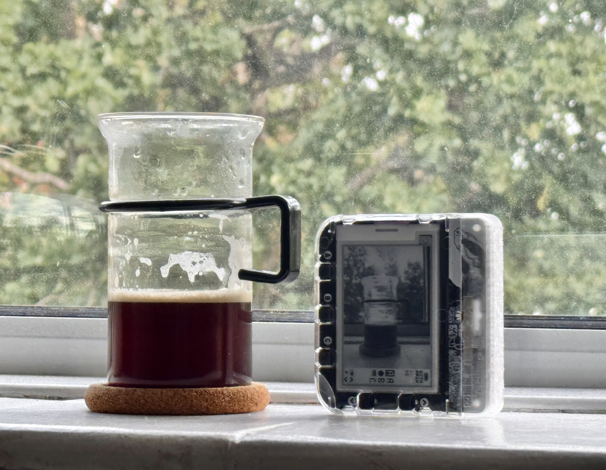
</p>

<h1 align="center">DITHRPIX</h1>

<p align="center">
  
  
  <a href="./LICENSE"></a>
</p>

<p align="center">
  <strong>A four-shade greyscale dither camera.</strong><br/>
  Built with the <a href="https://shop.pimoroni.com/products/badger-2350">Pimoroni Badger 2350</a> and a PTC06 TTL serial JPEG camera connected to the Qw/ST port, powered by Pimoroni's <a href="https://badgewa.re/docs">Badgeware API</a>.
</p>

<div align="center" style="line-height: 0;">
  <br>
  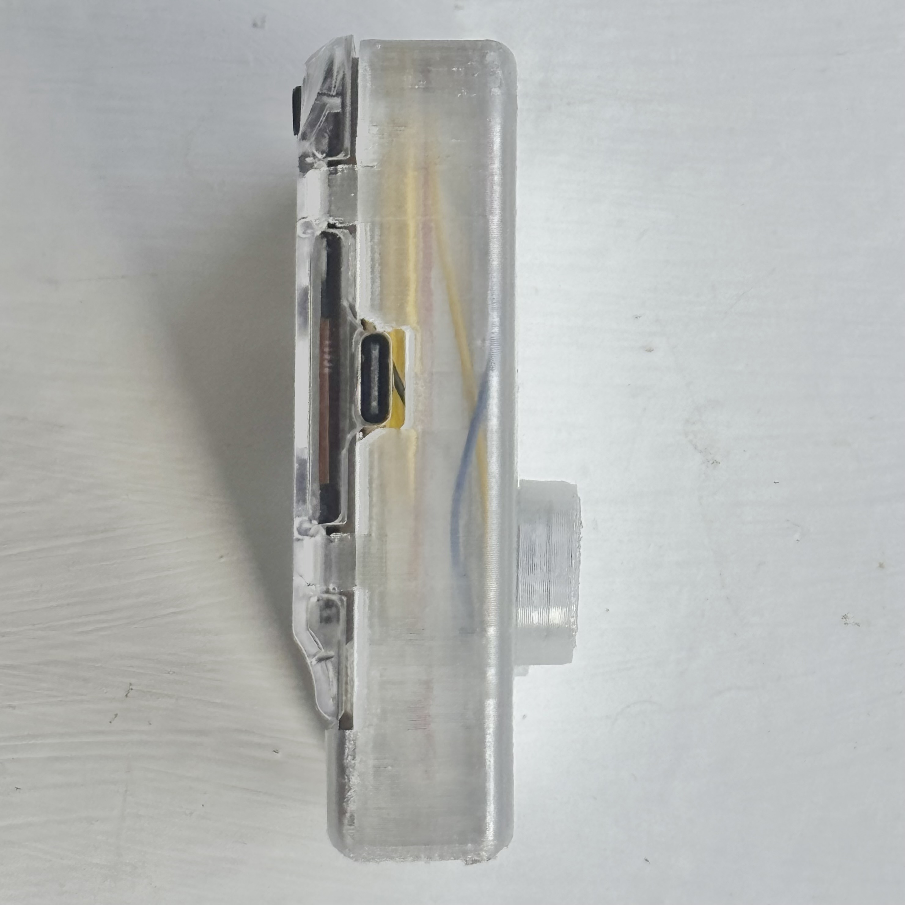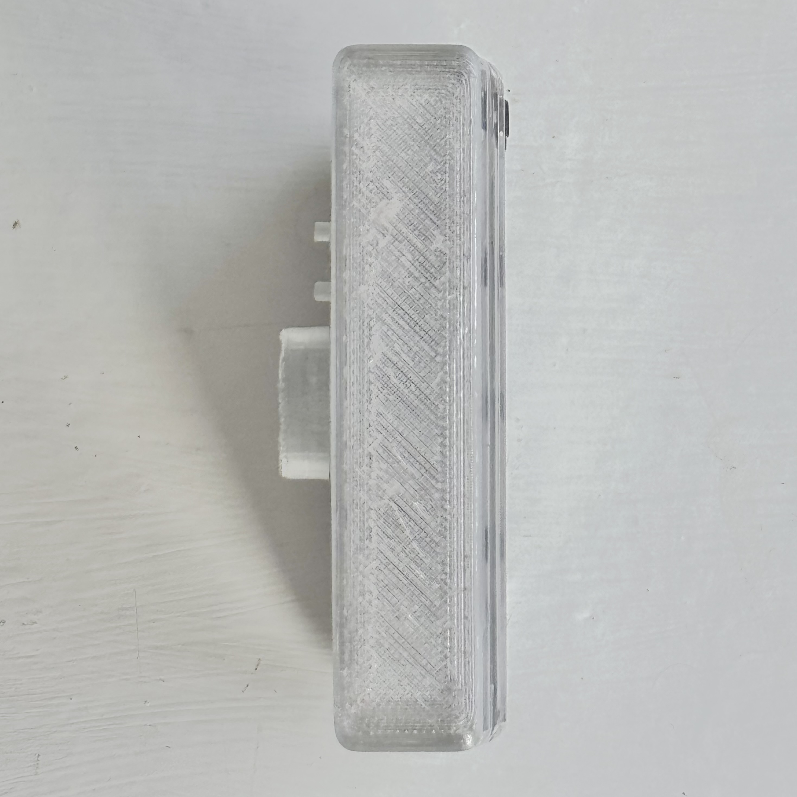<br>
  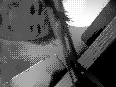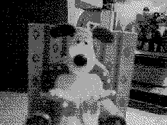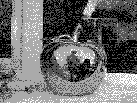<br>
  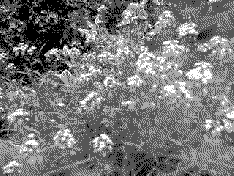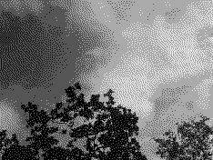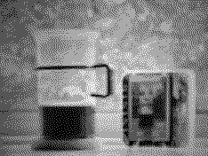<br>
  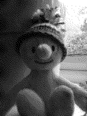
</div>

## Table of Contents
1. [Features](#features)
2. [Guide](#guide)
3. [Controls](#controls)
4. [Project Structure](#project-structure)
5. [Contributing](#contributing)
6. [License](#license)

## Features
- **Photos:** Camera module captures at 320x240, downsampled into the panel's 234x176 view (and saves byte-for-byte exactly what is on the screen).
- **Tone modes:** The camera handles exposure automatically, so these four modes act as a post-processing style. They let you select which slice of the incoming range gets stretched across the display's four shades:
  - **A (All):** Maps the full input range (0–255).
  - **H (High):** Stretches the darkest 50% (0–128), resulting in a brighter image.
  - **M (Mid):** Stretches the middle 50% (64–192), boosting overall contrast.
  - **L (Low):** Stretches the brightest 50% (128–255), resulting in a darker image.
- **Dither modes:** Bayer 4x4 ordered, Floyd-Steinberg, Atkinson, and flat posterise (the selected mode is shown as a cute mini swatch on the screen next to C).
  <div align="center" style="line-height: 0;">
    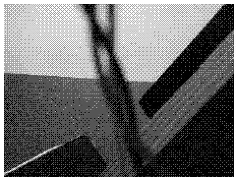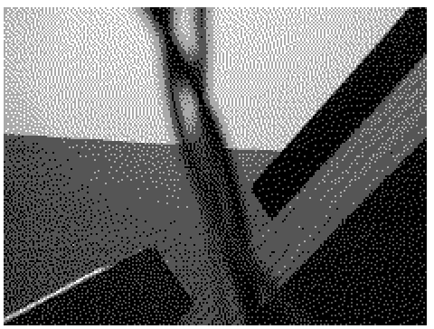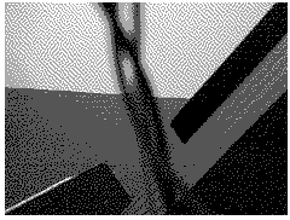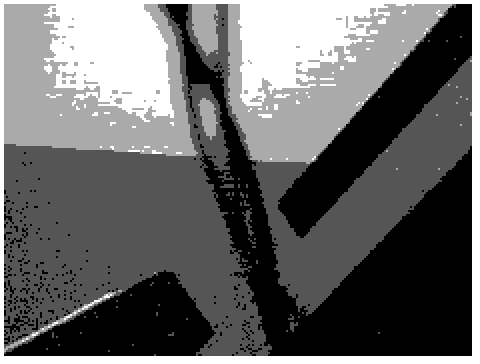
  </div>
- **Gallery storage:** Safely stores up to 60 photos (fits in 1MB LittleFS storage available to apps).
- **Indexed PNG exports:** Files are saved as uncompressed 2-bit indexed PNGs matching the hardware palette (`[0, 85, 170, 255]`).

## Guide

### 1. Hardware Prep
- [Pimoroni Badger 2350](https://shop.pimoroni.com/products/badger-2350?variant=55801169707387) (running [Badgeware v3.0.2 or later](https://badgewa.re/docs/introduction/update-your-firmware.md)).
- [PTC06 TTL serial JPEG camera](https://thepihut.com/products/miniature-ttl-serial-jpeg-camera-with-ntsc-video?variant=27739329809).
- [Qw/ST (JST-SH) to bare wire cable](https://thepihut.com/products/stemma-qt-qwiic-jst-sh-4-pin-to-premium-male-headers-cable?variant=19932905209918).
- Tiny M1 screws.

Solder the Qw/ST cable to the camera's power and serial pads, then connect it to the Badger 2350's Qw/ST port.

<div align="center">
  
</div>

### 2. Software Installation
Install alongside existing Badger apps, or replace the main launcher to boot directly into the camera.

1. Put the badge into disk mode (press **RESET** twice).
2. Wait for it to mount as `BADGER`.
3. Copy the application files:
   ```bash
   # Copy the camera app directory
   cp app/dithcam/*.py app/dithcam/icon.png /path/to/BADGER/apps/dithcam/
   
   # Optional: Replace the default launcher to boot directly to the camera
   cp boot/main.py /path/to/BADGER/main.py
   ```
4. Sync and unmount the drive before resetting:
   ```bash
   sync
   udisksctl unmount -b /dev/sda
   ```
5. Press **RESET** on the badge to test the software.

### 3. Assembly

<div align="center">
  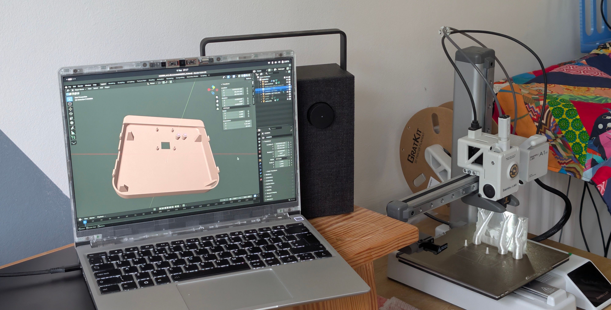
</div>
<br>

Once you have tested the camera, print the back case which replaces the factory one. I used [GratKit clear PETG](https://gratkit.com/products/gratkit-petg-3d-printing-filament-1-75mm-basic-petg-1kg?variant=40792277745744) for the print.

The .stl for printing is here: [`hardware/DITHRPIX_BACK_CASE.stl`](hardware/DITHRPIX_BACK_CASE.stl)

I recommend printing the case upside down for a balance between supports and strength.

*Note: The case mounts the camera upside-down for clearance, so the app applies a 180-degree rotation by default to compensate.*

### 4. Managing Photos
First, connect the badge to your computer via USB. Ensure it is powered on and in its normal running state (not disk mode) so that `mpremote` can communicate with it over serial.

To pull your photos off the badge, you can use `mpremote`:
```bash
mpremote cp -r :photos/ ./my-photos/
```

To wipe the gallery and reclaim space on the 1MB partition, run:
```bash
mpremote exec "import os; [os.remove('photos/' + f) for f in os.listdir('photos')]"
```

## Controls

| Button | Camera Mode | Gallery Mode |
| ------ | ----------- | ------------ |
| **A**  | Cycle tone mode | — |
| **B**  | Take a photo | Back to camera |
| **C**  | Cycle dither mode | Delete photo (asks first) |
| **UP** | Open gallery | View older photo |
| **DOWN** | Refresh the preview | View newer photo (or back to camera) |

## Project Structure

```text
dithrpix/
├── app/dithcam/     # The application (installed to /system/apps/dithcam)
├── boot/main.py     # Boot script (installed to /system/main.py)
├── hardware/        # 3D models and physical design files
└── tools/           # Probe scripts used for testing hardware behaviors
```

## Contributing

Feedback, ideas, and PRs are super welcome! Whether you want to add a new dither mode, tweak the UI, or just fix a typo, feel free to jump in and open an issue or pull request.

## License

MIT © 2026 Jonothan Hunt — see [LICENSE](LICENSE) for the full text.
